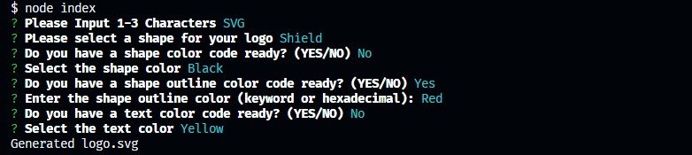

<!--Used README.md Generator-->

# Logo Generator

[](https://opensource.org/licenses/MIT)

## Description
The Logo Generator Project is a command-line application that allows users to create customized logos by selecting different shapes, colors, and text. This project is designed to provide a simple and flexible way to generate logos for various purposes, such as branding, marketing, or personal use.

## Shape Options
- Circle
- Square
- Triangle
- Rectangle
- Shield
- Star

## Live Preview


## Table of Contents
- [Installation](#installation)
- [Usage](#usage)
- [Credits](#credits)
- [License](#license)
- [Contributing](#contributing)
- [Questions](#questions)

## Installation
Before using this application, you'll need to install the necessary dependencies. To do so, follow these steps: 
```npm install -y
npm install inquirer
npm install jest
```

## Usage
Follow the on-screen prompts to customize your logo, including selecting the shape, colors, and text.

Once all selections are made, the application will generate your logo and save it as logo.svg in the project directory.

## Credits 
* [Example SVG](https://static.fullstack-bootcamp.com/fullstack-ground/module-10/circle.svg)

* [Scalable Vector Graphics (SVG)](https://en.wikipedia.org/wiki/Scalable_Vector_Graphics)

* [SVG tutorial](https://developer.mozilla.org/en-US/docs/Web/SVG/Tutorial)

* [Basic SVG shapes](https://developer.mozilla.org/en-US/docs/Web/SVG/Tutorial/Basic_Shapes)

* [Text in SVG](https://developer.mozilla.org/en-US/docs/Web/SVG/Tutorial/Texts)

* [SVG VS Code extension](https://marketplace.visualstudio.com/items?itemName=jock.svg)
## License 
### This project is licensed under the terms of
### The MIT License
[https://opensource.org/licenses/MIT](https://opensource.org/licenses/MIT)

## Contributing
If you would like to contribute to this project, please follow the guidelines outlined in the Contributing Guide.

## Questions
If you have questions or need further assistance with this project, please feel free to contact me via:
- E-Mail: CarrilloUriel81@gmail.com
- GitHub: [UCarr81](https://github.com/UCarr81)